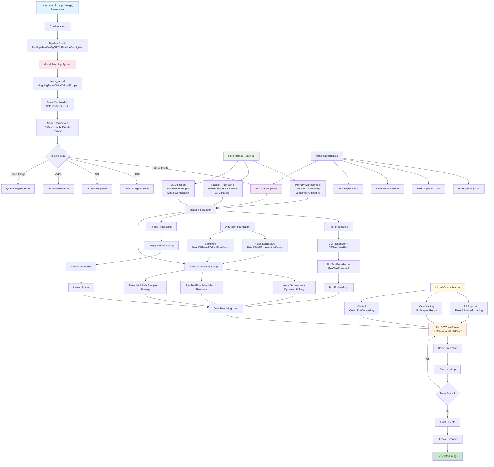

# DiffSynth-Engine Architecture Diagram

This mermaid diagram shows the overall architecture and flow of the DiffSynth-Engine, which is a high-performance inference engine for diffusion models.

## Architecture Overview

The DiffSynth-Engine follows a modular architecture with these key components:

### 1. **Pipeline Layer** 
- **FluxImagePipeline**: Primary image generation pipeline using Flux models
- **SDXLImagePipeline**: Stable Diffusion XL pipeline
- **SDImagePipeline**: Standard Stable Diffusion pipeline  
- **WanVideoPipeline**: Video generation pipeline
- **QwenImagePipeline**: Qwen image generation pipeline

### 2. **Text Processing**
- **Tokenizers**: CLIPTokenizer and T5TokenizerFast for text preprocessing
- **Text Encoders**: CLIP and T5 models for text embedding generation
- **Prompt Encoding**: Converts text prompts to numerical embeddings

### 3. **Image Processing** 
- **VAE Encoder**: Encodes images to latent space representation
- **VAE Decoder**: Decodes latents back to pixel space
- **Preprocessing**: Image normalization and format conversion

### 4. **Noise Scheduling & Sampling**
- **Schedulers**: Define noise schedules (Beta, DDIM, Exponential, etc.)
- **Samplers**: Implement sampling strategies (Euler, DPM++, DDPM, etc.)
- **Timestep Management**: Controls the denoising process progression

### 5. **Core Denoising**
- **DiT (Diffusion Transformer)**: Main neural network for noise prediction
- **Attention Mechanisms**: Self-attention and cross-attention layers
- **ControlNet Integration**: Optional conditioning for guided generation

### 6. **Advanced Features**
- **LoRA Support**: Low-rank adaptation for model customization
- **IP-Adapter & Redux**: Image-based conditioning
- **Parallel Processing**: Multi-GPU and distributed inference
- **Memory Management**: CPU/GPU offloading and optimization
- **Quantization**: FP8 and other precision optimizations

### 7. **Model Management**
- **State Dict Handling**: Loading and converting model weights
- **Device Management**: GPU/CPU memory allocation
- **Model Lifecycle**: Loading, offloading, and cleanup

The engine supports multiple diffusion model formats (Flux, SD, SDXL, Wan, Qwen) while providing a unified interface and extensive optimization features for high-performance inference.